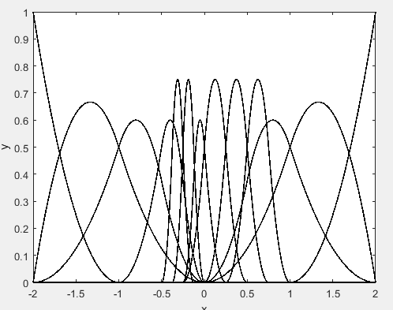
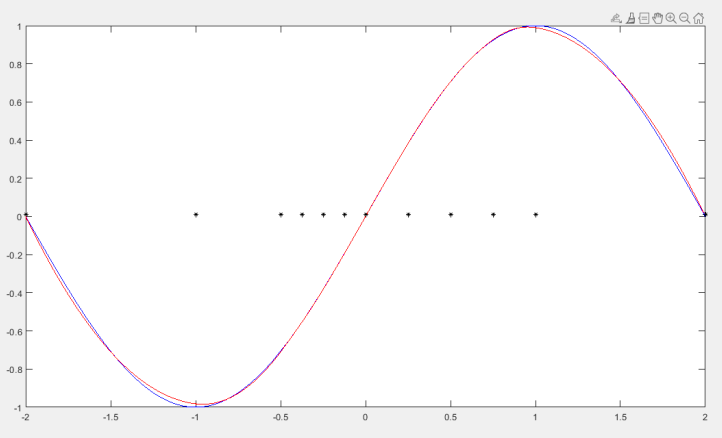
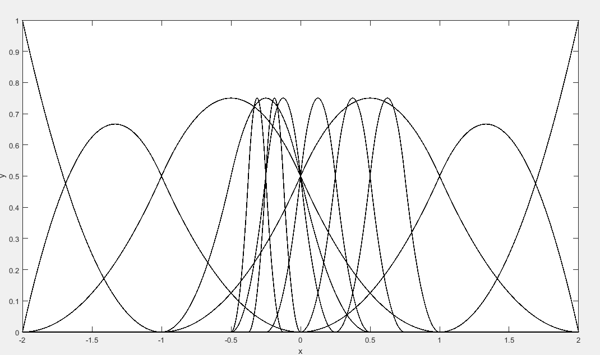
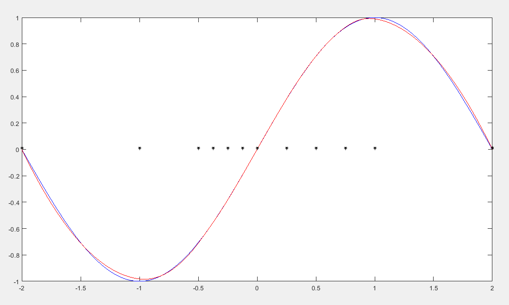
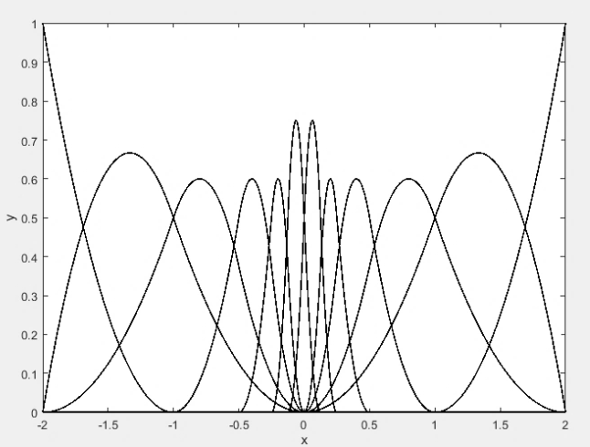
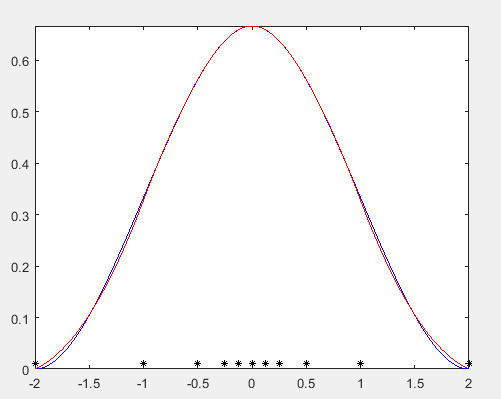
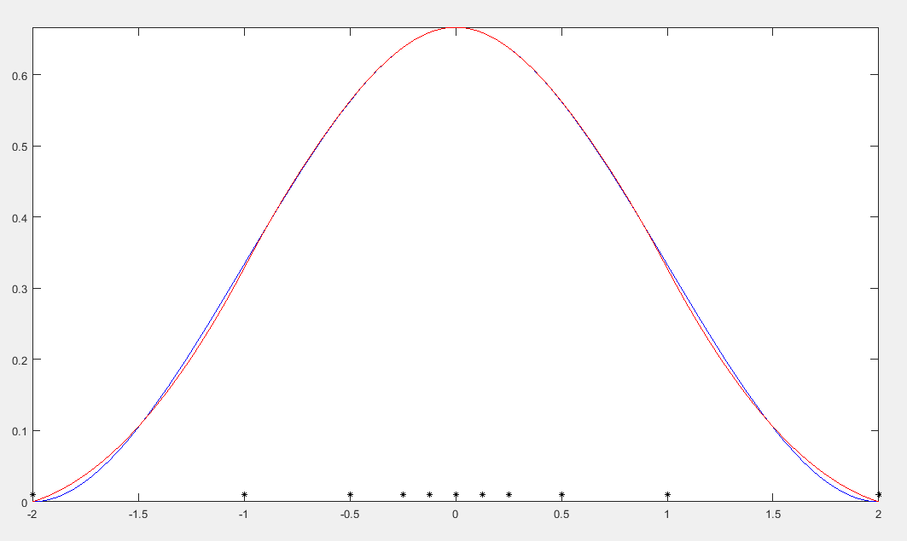

# Isogeometric-analysis-using-THB-Splines

This program solves a simple Poisson problem using (T)HB-Splines. The code is based on a project of mr. Jahnke, which works only for 1D case though. Thus, I extended his code in order to work for 2D case aswell.

Example 1 with THB-Splines

Example 1 with HB-Splines

Example 2 with THB-Splines

Example 2 with HB-Splines

