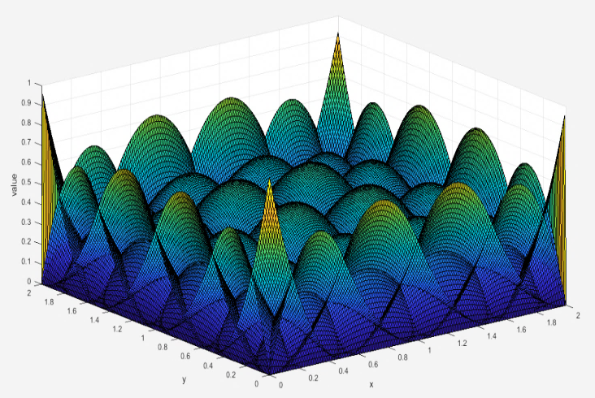
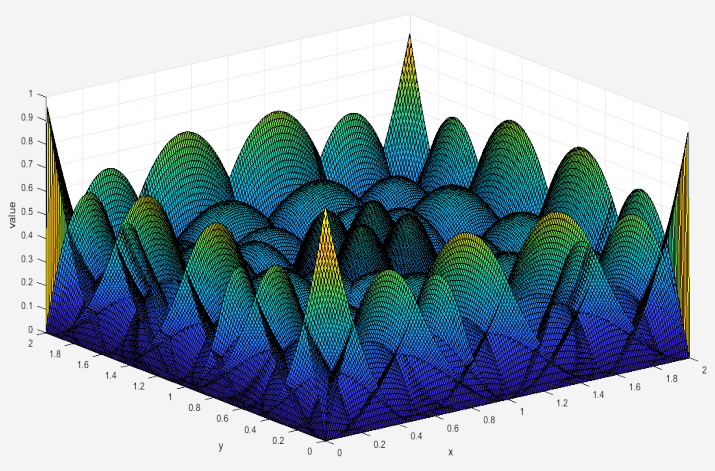
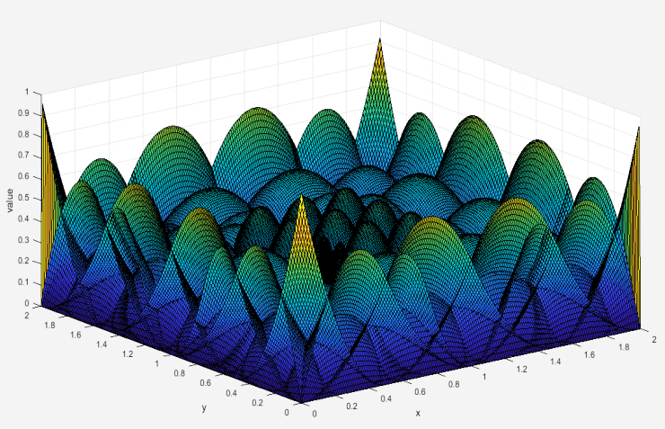
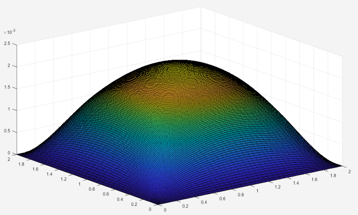

# Isogeometric-analysis-using-THB-Splines

This program solves a simple Poisson problem using (T)HB-Splines. The code is based on a project of mr. Jahnke, which works only for 1D case though. Thus, I extended his code by doing some work in 2D Isogeometric Analysis with THB. Specifically, I calculate all the necessary values in order to construct stiffness matrix and rhs, like the determinant of global and of local Jacobian. I managed to solve the Poisson problem, but the refinement has some bugs. Also, some examples for the 1D case are included below.

2D THB-Spines refinement

Example 1 with THB-Splines

Example 1 with HB-Splines

Example 2 with THB-Splines

Example 2 with HB-Splines

